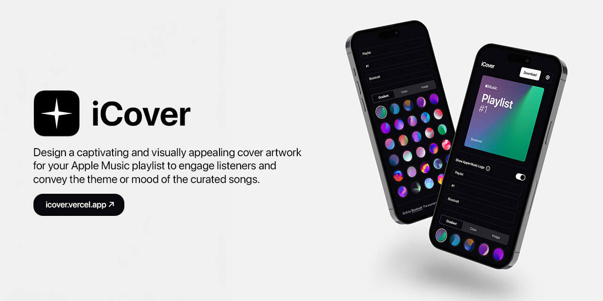

# iCover

Hey fellow Apple Music enthusiasts!

I'm thrilled to share with you a fantastic project I've been working on lately - [iCover](https://icover.vercel.app)! 🎉

Are you tired of your Apple Music playlists looking plain and generic? Want to give them that sleek, sophisticated Apple touch? Look no further! 🍏

Introducing [iCover](https://icover.vercel.app), the ultimate destination to create stunning Apple-style covers for your beloved playlists. With a user-friendly interface and a wide range of customization options,  [iCover](https://icover.vercel.app) lets you bring a touch of creativity and personalization to your music collection.

🎨 Design with Ease: Say goodbye to bland playlist covers! [iCover](https://icover.vercel.app) provides an intuitive design tool that allows you to craft eye-catching covers effortlessly. Pick from a library of Apple-inspired templates or unleash your inner artist with our custom design feature.

📸 High-Resolution Graphics: Your playlists deserve the best quality! [iCover](https://icover.vercel.app) ensures your artwork is presented in high-resolution, guaranteeing a seamless viewing experience across all devices.

🔁 Edit and Update: Change your mind or refresh your playlists? No problem! [iCover](https://icover.vercel.app) lets you edit your covers whenever you desire, giving you the freedom to adapt to your evolving musical tastes.

💾 Save and Share: Once you've created your masterpiece, save it to your device or share it directly with friends and the Apple Music community. Show off your unique style and inspire others to elevate their playlists too!

🚀 Ready to Get Started? Visit  [iCover](https://icover.vercel.app) now at [icover.vercel.app](https://icover.vercel.app) and experience the magic of Apple-style covers for your playlists. It's time to make your music collection truly stand out! 🌟

Spread the word, share the love, and let's take our Apple Music playlists to a whole new level together. Happy playlisting, everyone! 🎶🍎 

The source code is available on [GitHub](https://github.com/boostvolt/icover) leave a star if you like it. ❤️

_(Note: This project is not sponsored by or affiliated with Apple Music.)_